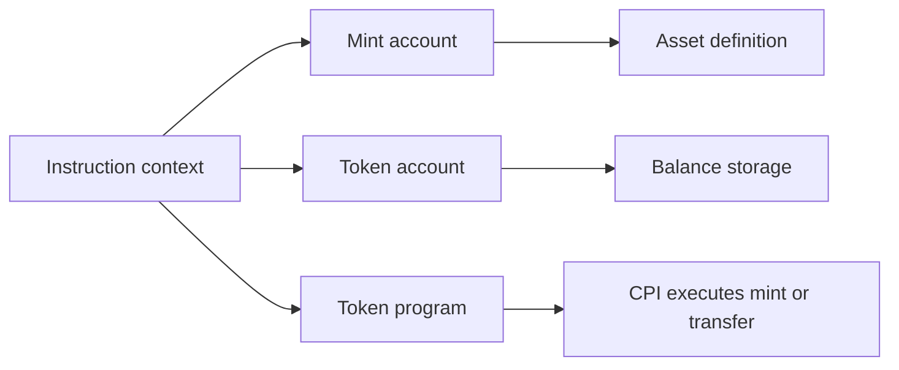

After PDAs, token integration is the next big step.

This is where Solana programs stop looking like generic state machines and start handling real balances, real authorities, and real asset movement.

The mistake beginners make here is trying to memorize token APIs before the account model is clear.

Do not do that.

First understand the accounts.

Then the CPI code becomes much easier to read.

## The Three Token Accounts You Must Understand

At the first-pass level, token integration revolves around three things:

- the mint account
- the token account
- the token program

### The mint account

The mint defines the token itself.

It stores rules like:

- decimals
- mint authority
- optional freeze authority

If you do not know which mint is involved, you do not really know what asset your program is touching.

### The token account

A token account holds a balance of one mint for one owner.

In most app flows, this is often an ATA, an associated token account.

The important idea is simpler than the name:

- a mint defines the asset
- a token account holds some quantity of that asset

### The token program

This is the program that actually implements token logic.

Today, that may be:

- the classic SPL Token program
- Token-2022

That distinction matters.

The current Anchor docs push you toward `token_interface` types so one account model can work across both token programs.

<ConceptCards
  concepts={[
    {
      term: "Mint",
      definition:
        "The account that defines one token asset, including decimals and mint-authority rules.",
    },
    {
      term: "Token Account",
      definition:
        "The balance-holding account for one owner and one mint.",
    },
    {
      term: "Token Interface",
      definition:
        "The modern Anchor account model that works across the classic token program and Token-2022.",
    },
    {
      term: "transfer_checked",
      definition:
        "A token instruction that keeps the transfer aligned with the mint's decimal configuration.",
    },
  ]}
/>

<InfoCallout title="Why Token Program Choice Matters">
Do not hardcode your lesson mental model around the old idea that there is only one token program.

The modern Anchor pattern is to be explicit about which token program is being used.
</InfoCallout>

## Why `token_interface` Is The Right Default

The current Anchor token docs use:

- `InterfaceAccount<'info, Mint>`
- `InterfaceAccount<'info, TokenAccount>`
- `Interface<'info, TokenInterface>`

That is the right default because it lets your instruction accept accounts from either Token or Token-2022, as long as the account shape is compatible.

That is much better than teaching a narrow legacy path first and fixing it later.



## Start With One Mint Instruction

Here is the smallest useful minting example.

```rust
use anchor_lang::prelude::*;
use anchor_spl::token_interface::{
    mint_to, Mint, MintTo, TokenAccount, TokenInterface,
};

#[derive(Accounts)]
pub struct MintRewards<'info> {
    #[account(mut)]
    pub authority: Signer<'info>,

    #[account(mut)]
    pub mint: InterfaceAccount<'info, Mint>,

    #[account(mut)]
    pub destination: InterfaceAccount<'info, TokenAccount>,

    pub token_program: Interface<'info, TokenInterface>,
}

pub fn mint_rewards(ctx: Context<MintRewards>, amount: u64) -> Result<()> {
    let cpi_accounts = MintTo {
        mint: ctx.accounts.mint.to_account_info(),
        to: ctx.accounts.destination.to_account_info(),
        authority: ctx.accounts.authority.to_account_info(),
    };

    let cpi_ctx = CpiContext::new(
        ctx.accounts.token_program.to_account_info(),
        cpi_accounts,
    );

    mint_to(cpi_ctx, amount)?;
    Ok(())
}
```

## Read That Example Slowly

### `mint: InterfaceAccount<'info, Mint>`

This is the mint account.

It tells Anchor to deserialize the account as mint data, regardless of whether the mint came from the classic token program or Token-2022.

### `destination: InterfaceAccount<'info, TokenAccount>`

This is the balance-holding account that will receive the minted tokens.

That account is tied to:

- one mint
- one owner

### `token_program: Interface<'info, TokenInterface>`

This is the token program Anchor will call during CPI.

That explicit account is important.

Your instruction should not be vague about which token program is actually being trusted to execute the token logic.

### `MintTo`

This is the CPI account struct for the token minting operation.

You are building the account set the token program expects.

### `CpiContext::new(...)`

This packages:

- the target program
- the CPI accounts

Then `mint_to(...)` performs the actual token CPI.

That is the pattern you will see over and over in Anchor token code.

## What This Example Still Does Not Validate

The example above teaches the CPI shape, but it is not the full security story yet.

Before you trust a minting flow in a real app, you still need to answer questions like:

- is this the mint we intended to use?
- is the destination token account for that same mint?
- is the signer actually the authority that should be allowed to mint?
- should the authority be a wallet signer or a PDA signer?

That is why token integration is mostly an account-validation problem, not just a CPI syntax problem.

## Create A Mint With Anchor Constraints

The current Anchor docs also support mint creation directly through account constraints.

Here is the modern shape:

```rust
use anchor_spl::token_interface::{Mint, TokenInterface};

#[derive(Accounts)]
pub struct CreateMint<'info> {
    #[account(mut)]
    pub signer: Signer<'info>,

    #[account(
        init,
        payer = signer,
        mint::decimals = 6,
        mint::authority = signer.key(),
        mint::freeze_authority = signer.key(),
    )]
    pub mint: InterfaceAccount<'info, Mint>,

    pub token_program: Interface<'info, TokenInterface>,
    pub system_program: Program<'info, System>,
}
```

This is worth reading carefully.

Anchor is not just creating a generic account here.

It is creating and initializing a mint account with token-specific rules.

That is why the `mint::...` constraints matter.

## Token Transfers Should Usually Be Checked

For transfers, the safer default is `transfer_checked`.

```rust
use anchor_spl::token_interface::{transfer_checked, Mint, TokenAccount, TokenInterface, TransferChecked};

#[derive(Accounts)]
pub struct TransferPoints<'info> {
    pub owner: Signer<'info>,

    pub mint: InterfaceAccount<'info, Mint>,

    #[account(mut)]
    pub from_ata: InterfaceAccount<'info, TokenAccount>,

    #[account(mut)]
    pub to_ata: InterfaceAccount<'info, TokenAccount>,

    pub token_program: Interface<'info, TokenInterface>,
}

pub fn transfer_points(ctx: Context<TransferPoints>, amount: u64, decimals: u8) -> Result<()> {
    let cpi_accounts = TransferChecked {
        mint: ctx.accounts.mint.to_account_info(),
        from: ctx.accounts.from_ata.to_account_info(),
        to: ctx.accounts.to_ata.to_account_info(),
        authority: ctx.accounts.owner.to_account_info(),
    };

    let cpi_ctx = CpiContext::new(
        ctx.accounts.token_program.to_account_info(),
        cpi_accounts,
    );

    transfer_checked(cpi_ctx, amount, decimals)?;
    Ok(())
}
```

## Why `transfer_checked` Is Better Than Hand-Waving

The important beginner idea is not just “use this function because docs say so.”

The real reason is that token amounts and decimals are part of the asset definition.

A checked transfer forces the transfer logic to stay aligned with the mint’s decimal configuration.

That is one more place where explicitness reduces bugs.

## The Real Validation Questions For Token Flows

Whenever you read or write an Anchor token instruction, ask these questions:

1. which mint is this instruction supposed to work with?
2. do both token accounts belong to that mint?
3. who is the real authority over the action?
4. which token program is actually being called?
5. if a PDA is involved, where do the signer seeds come from?

Those five questions matter more than memorizing CPI helper names.

## A Better Beginner Guardrail List

For token flows, the first serious guardrails are:

- validate that the token accounts match the expected mint
- validate that the authority is who your business logic expects
- do not assume the client passed the correct token program by accident
- prefer explicit checked operations when the token API offers them
- keep minting rules and supply rules on-chain, not only in the frontend

## Where PDAs Usually Enter Token Logic

The lesson before this one taught PDA state.

In token flows, PDAs often become:

- mint authorities
- vault authorities
- claim record accounts
- escrow state accounts

That is why this lesson comes after PDAs.

The PDA mental model is what makes token authority flows understandable.

## One Good Beginner Example To Keep In Mind

A strong first token design usually looks like this:

- one mint
- one clearly defined authority model
- one mint instruction or one transfer instruction
- one or two failure-path tests

A weak first token design tries to include:

- staking
- rewards
- vesting
- freeze logic
- metadata
- multiple mints
- custom economics

all at once.

Do not do that.

## Suggested Test Cases

If you are building token instructions, test these before moving on:

1. mint succeeds with the expected authority
2. mint fails with the wrong authority
3. transfer fails when the token accounts do not match the expected mint
4. transfer succeeds when the mint, accounts, and authority all line up

Those tests teach much more than a giant happy-path-only example.

## Common Beginner Mistakes

### Mistake 1: treating token accounts like generic accounts

They are not generic state bags.

They carry mint-specific balance state governed by the token program.

### Mistake 2: ignoring the token program account

If the token program is part of the instruction, it is part of the trust boundary.

Treat it that way.

### Mistake 3: trusting client-provided decimals blindly

If the operation depends on mint decimals, the mint itself matters.

Do not treat decimals as casual UI metadata.

### Mistake 4: focusing only on CPI syntax

Most token bugs are validation bugs.

The CPI helper call is often the easiest part.

## What Comes Next

The next lesson is where token flows and PDAs meet directly through signed CPI.

That is the point where authority delegation becomes the main idea, not just token account wiring.

## Quick Check

<QuickCheck
  id="anchor-token-interface-default"
  question="Why is `token_interface` the right default for modern Anchor token lessons?"
  options={[
    "Because it lets one account model work with both the classic token program and Token-2022",
    "Because it removes the need to pass a token program account",
    "Because it makes token accounts signer-free",
    "Because it automatically validates all mint-authority business rules",
  ]}
  correctIndex={0}
  explanation="The interface types keep the lesson aligned with both token program families instead of teaching one narrow legacy path."
/>

<QuickCheck
  id="anchor-token-validation-priority"
  question="What is the main security question in a token instruction before you focus on CPI syntax?"
  options={[
    "Whether the mint, token accounts, authority, and token program are the exact ones the business logic expects",
    "Whether the token helper function name is the newest one in the docs",
    "Whether the client can render the token symbol correctly",
    "Whether the destination ATA already has a nonzero balance",
  ]}
  correctIndex={0}
  explanation="Most token bugs are account-validation bugs. The CPI helper is often the easy part."
/>

<UpNextCard
  nextTitle="Cross-Program Invocations"
  nextDescription="Take the token account model one layer deeper by learning how Anchor packages a CPI, and how PDA signer seeds turn program authority into real calls."
  nextHref="/learn/anchor-programs/cpi-cross-program"
  nextReadingTime={12}
  prevTitle="PDAs and Seed Derivation"
  prevHref="/learn/anchor-programs/pda-seed-derivation"
  moduleName="Anchor Programs"
/>
